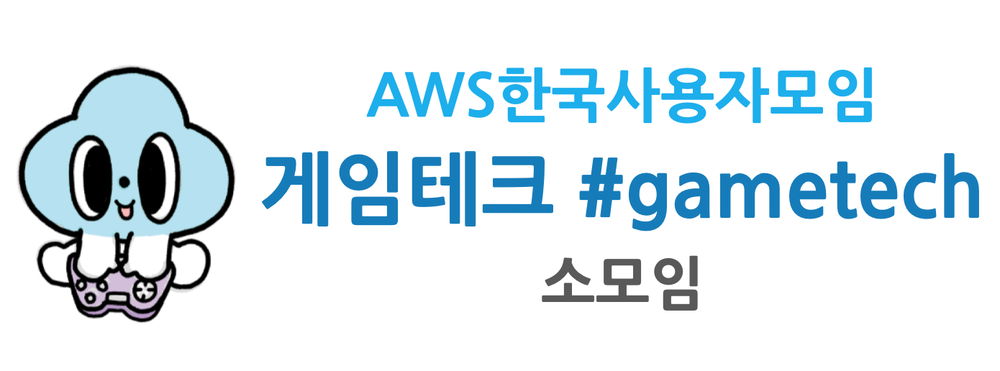

<!-- markdownlint-disable-file -->
# AWSKRUG #gametech(게임테크) 소모임

- since 2023
- [AWSKRUG Facebook Link](https://www.facebook.com/groups/awskrug/)
- [AWSKRUG Meetup Link](https://www.meetup.com/ko-KR/awskrug/)
- [AWSKRUG Web Site](http://www.awskr.org/)
- [AWSKRUG Slack Channel LInk](http://awskrug.slack.com)

# 모임 소개

- AWSKRUG 게임테크 소모임은 게임 개발자들이 모여 서로의 경험과 지식을 공유하는 모임입니다.
- 초보자부터 숙련자까지 모두 참석 가능합니다. 경험 공유, 스터디, 구인/구직 등의 다양한 목적을 가진 분들이 모여 서로 매너를 지키면서 편안한 분위기를 만들어 나가는 모임이 되었으면 좋겠습니다.

# 발표자 보상

- 발표를 하시는 분들은 AWS 크레딧을 드리니 많이 발표지원 해주세요~ (크레딧 금액은 사정상 달라질 수 있음)

# Meetups

## 2023년  

  
1st meetup - <b>RDS online alter부터 CPU 100% 장애까지 & 데브시스터즈 사내방송 인프라 제작기</b>

  ### `1st meetup`
  - **주최**
    - [2023년 03월 28일 / 데브시스터즈](https://www.meetup.com/awskrug/events/292003339)
  - **주제**
    - 발표 1
      - [`황재영(데브시스터즈)`]()님 - [RDS online alter부터 CPU 100% 장애까지](./keynotes/RDS_online_alter부터_CPU_100%_장애까지.pdf)
    - 발표 2
      - [`이상유(데브시스터즈)`]()님 - [데브시스터즈 사내방송 인프라 제작기](./keynotes/데브시스터즈_사내방송_인프라_제작기.pptx.pdf)

  &nbsp;&nbsp;&nbsp;&nbsp;&nbsp;&nbsp;&nbsp;&nbsp;
  
  &nbsp;&nbsp;&nbsp;&nbsp;&nbsp;&nbsp;&nbsp;&nbsp;
  
  
  &nbsp;&nbsp;&nbsp;&nbsp;&nbsp;&nbsp;&nbsp;&nbsp;
  
  

